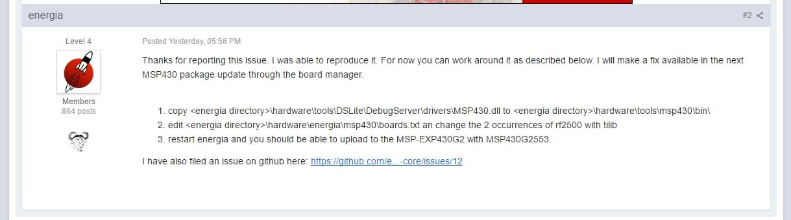

## Robótica Semestre 2019-1

# Prácticas de Robótica 

Se esta usando el microcontrolador MSP-EXP430G2553 de la fabrica Texas Instruments.
Las especificaciones de los pines se muestran en la siguiente imagen: 

Las prácticas tienen terminación .ino 

Para las prácticas de este repositorio se necesita instalar **Energia** que puede descargar del siguiente link [Descargar Energia](https://energia.nu/download/)

Después de instalar Energia en `Windows` se deben hacer las siquientes modificaciones.

 

**Estas modificaciones funcionaron en Agosto del 2018.**

